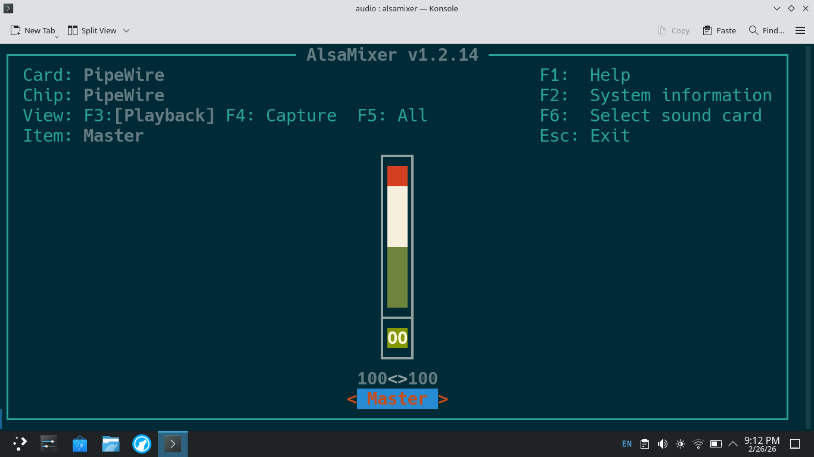
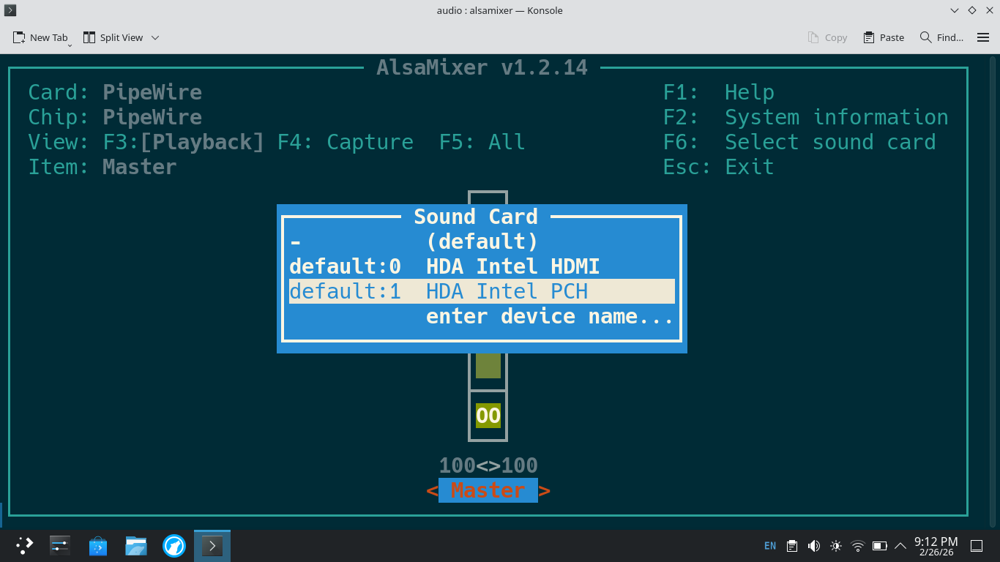
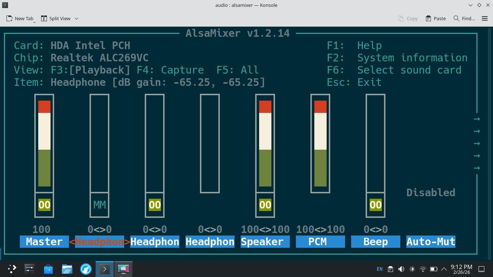
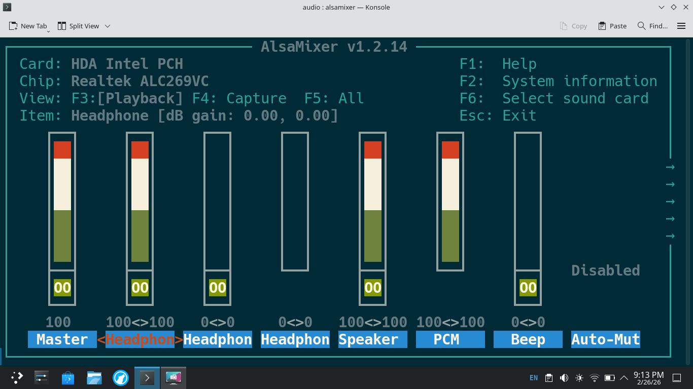

# Tricks for Toughbook CF-C2 and Ubuntu/Debian
In an attempt to save others time here's some tricks and hacks I've done on my Ubuntu 20.04 and Debian 13 install on a Panasonic Toughbook CF-C2 mk2.

## Fix for screen brightness not changing
*Update* at least on Debian 13 this is not needed.
Edit /etc/default/grub and change this line:  
`GRUB_CMDLINE_LINUX_DEFAULT="quiet splash"`  
to:  
`GRUB_CMDLINE_LINUX_DEFAULT="quiet splash acpi_osi="`  

## GPS Time Update
Check out the gpsd folder to see how I was able to get GPS time to work.

## Fix for speaker not working
Mainly what you need to do is select and unmute the speaker in alsamixer and then save the state in alsactl and then create a systemd unit to restore the state on boot. Following was tested on Debian 13 with pipewire installed but should work in ubuntu as well.
1. open alsamixer

2. press F6

3. select Intel PCH
4. use right arrow to slect Headphone (for me this was the first slot next to master)

5. If "MM" apears in the headphone mixer, hit the m key which will change it to ""00"
6. use up arrow to set desired volume

7. do not close alsamixer, open a new terminal tab or new terminal
8. `sudo alsactl store` to save the alsamixer state. you may close alsamixer if you'd like
9. test that audio is working `speaker-test -t wav -c 2` you should hear this coming out of the small spearker in the left. The panasonic specs show this speaker as mono.
9. now we setup the systemd unit to restore the alsamixer state on boot
```bash
sudo cp ./force-audio-restore.service /etc/systemd/system/
sudo systemctl daemon-reload
sudo systemctl enable force-audio-restore.service
```
10. test this with a reboot and then another speaker-test and you should be good.

I added the service to manually run `sudo alsactl restore` since the alsa-restore service didn't seem to be working correctly even though there were no errors from that service.